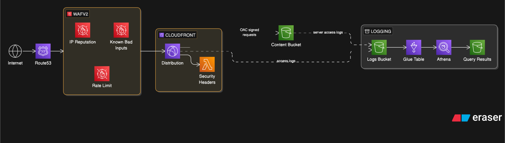
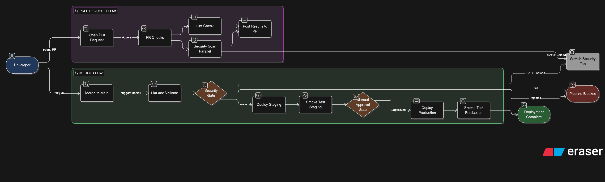
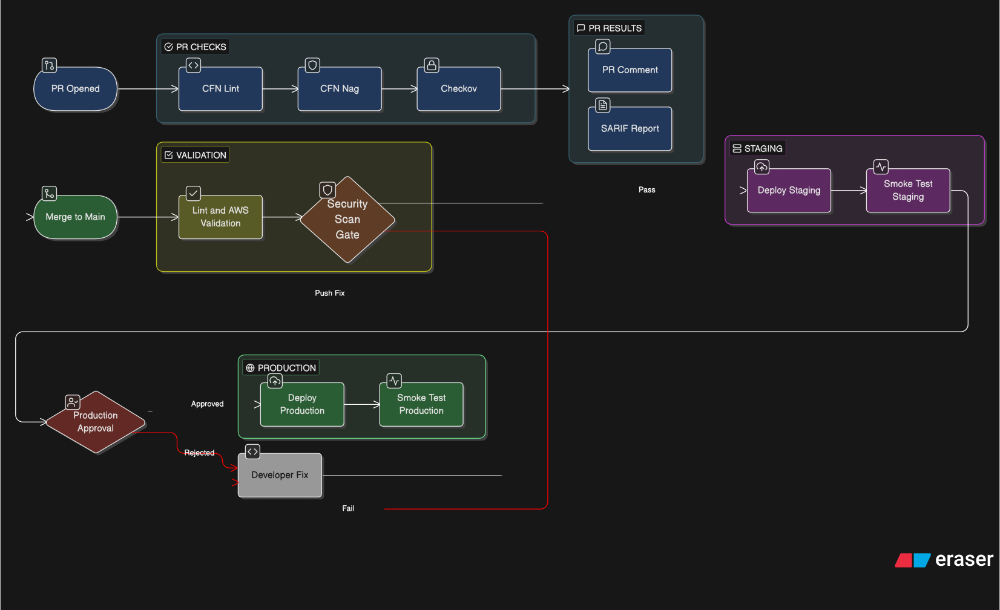

# Project 1 — Secure Static Website

A production-grade static website on AWS, built to demonstrate secure cloud architecture, infrastructure-as-code, and DevSecOps practices. Every component is deployed via CloudFormation and updated through a GitHub Actions CI/CD pipeline that uses OIDC — no static AWS credentials are stored anywhere.

---

## Architecture Overview

Infrastructure:


CI/CD Pipeline:


The deployment pipeline wrapping this infrastructure is documented in [docs/devsecops-pipeline.md](./docs/devsecops-pipeline.md).

---

## Key Design Decisions

### Why Origin Access Control (OAC) instead of Origin Access Identity (OAI)?

OAC is the current AWS recommendation (OAI is legacy). OAC signs requests with SigV4 and supports SSE-KMS encrypted buckets — OAI does not. The bucket policy is scoped to the *specific distribution ARN*, not just the account, meaning no other CloudFront distribution in the account can read this bucket even if someone tried.

### Why is the entire stack in us-east-1?

Two constraints force this:
1. ACM certificates used with CloudFront must be provisioned in `us-east-1`.
2. WAFv2 Web ACLs with `CLOUDFRONT` scope must also be in `us-east-1`.

Deploying everything in one region keeps the CloudFormation template simple and avoids cross-region stack references. The CloudFront edge network still serves content globally from the nearest PoP regardless of where the origin stack lives.

### Why a CloudFront Function for security headers instead of a Response Headers Policy?

A managed Response Headers Policy would cover most cases, but CloudFront Functions allow:
- Custom logic (conditional headers, per-path overrides)
- A detailed, version-controlled CSP that can be iterated on
- The headers to be applied even on CloudFront-generated error responses

The function runs at the edge with sub-millisecond overhead and is billed at ~$0.10 per million invocations — effectively free at portfolio scale.

### Why OIDC for GitHub Actions instead of IAM access keys?

Storing long-lived AWS access keys as GitHub secrets is an unnecessary security risk. OIDC lets GitHub Actions request a short-lived STS token (valid for the duration of the workflow run) by proving its identity to AWS via a JWT. If the repo is ever compromised, there are no credentials to exfiltrate. The IAM role trust policy is scoped to a specific repo *and* branch, so only pushes to `main` in the repo can assume the role.

### Why PriceClass_100?

CloudFront pricing is based on which edge locations serve your traffic. `PriceClass_100` (US, Canada, Europe) is the cheapest tier. For a portfolio site, the traffic will almost certainly come from these regions. Switching to `PriceClass_All` adds coverage in Asia-Pacific, South America, and the Middle East at ~2-3× the data transfer cost.

### S3 versioning on the content bucket

Versioning means every `s3 sync` creates a new version of each object rather than overwriting in place. If a bad deploy goes out, you can roll back by restoring previous object versions without re-running the pipeline. The trade-off is slightly higher S3 storage costs — negligible for a static site.

---

## Security

| Layer | Control |
|---|---|
| Network | WAFv2 managed rules (common exploits, IP reputation, known-bad inputs) |
| Network | Rate limiting: 2,000 req / 5 min per IP |
| Transport | TLS 1.2+ enforced, HTTP redirected to HTTPS |
| Transport | HSTS with 2-year max-age + preload |
| Origin | S3 public access fully blocked; OAC SigV4 signing required |
| Origin | Bucket policy scoped to specific CloudFront distribution ARN |
| Response | Strict CSP, X-Frame-Options: DENY, X-Content-Type-Options: nosniff |
| Response | Permissions-Policy disabling camera, mic, geolocation, payment |
| CI/CD | OIDC authentication — no long-lived credentials |
| CI/CD | IAM role scoped to specific repo and branch |
| CI/CD | Automated security header audit on every deploy |

### Security Header Scores

After deployment, verify headers using:
- [securityheaders.com](https://securityheaders.com)
- [Mozilla Observatory](https://observatory.mozilla.org)
- `curl -sI https://yourdomain.com`

The configuration in this repo targets an **A+** rating on securityheaders.com.

---

## Observability

CloudFront access logs are delivered to S3 and queryable via Athena. The Glue table schema maps all standard CloudFront log fields.

### Available Queries (`athena-queries/`)

| File | Purpose |
|---|---|
| `log-analysis.sql` | Top pages, error analysis, geographic distribution, cache performance, WAF blocks |

### Example: Check cache hit rate

```sql
SELECT
    date,
    COUNT(*)                                             AS total_requests,
    SUM(CASE WHEN x_edge_result_type = 'Hit'
             THEN 1 ELSE 0 END)                         AS cache_hits,
    SUM(CASE WHEN x_edge_result_type = 'Miss'
             THEN 1 ELSE 0 END)                         AS cache_misses,
    SUM(CASE WHEN x_edge_result_type = 'RefreshHit'
             THEN 1 ELSE 0 END)                         AS refresh_hits,
    ROUND(
        SUM(CASE WHEN x_edge_result_type = 'Hit' THEN 1 ELSE 0 END)
        * 100.0 / NULLIF(COUNT(*), 0), 2
    )                                                    AS cache_hit_pct,
    ROUND(SUM(sc_bytes) / 1048576.0, 2)                 AS total_mb_served
FROM cloudfront_access_logs
WHERE CAST(date AS DATE) >= CURRENT_DATE - INTERVAL '30' DAY -- Fixed casting
GROUP BY date
ORDER BY date DESC;
```

A well-configured static site should show **>90% cache hit rate**. If it's lower, check the `Cache-Control` headers and CloudFront cache policy settings.

---

## DevOps Practices

### CI/CD Pipeline

Two workflow files implement a full DevSecOps pipeline. See [docs/devsecops-pipeline.md](./docs/devsecops-pipeline.md) for full detail.

**`pr-checks.yml`** — triggers on every PR to `main` touching `infrastructure/`.

**`deploy.yml`** — triggers on push to `main`.



| Stage | What it does |
|---|---|
| `lint` | cfn-lint + AWS API template validation |
| `security-scan` | cfn-nag (CFN-specific security) + checkov (1000+ IaC policies) |
| `deploy-staging` | Deploys isolated staging stack; validates template against real AWS APIs |
| `smoke-staging` | HTTP check + security header audit against staging CloudFront URL |
| `approve-production` | Pauses for manual reviewer approval via GitHub Environment protection |
| `deploy-production` | Deploys production stack, syncs content, waits for CF invalidation |
| `smoke-production` | Full security header audit with value assertions on production |

**Cache header strategy:**
- `*.html` → `max-age=300` (5 minutes): allows content to update quickly
- All other assets → `max-age=31536000, immutable` (1 year): aggressive caching for performance

The pipeline uses **concurrency groups** — a second push cancels any in-progress run, preventing race conditions and double-deploys.

### Infrastructure as Code

The entire stack is described in `infrastructure/template.yaml`. Nothing is created through the console. This means:
- The stack can be destroyed and recreated identically at any time
- Every change is tracked in Git history with a commit message
- Pull requests show infrastructure diffs before merging

---

## Cost Estimate

| Service | Usage assumption | Monthly cost (approx.) |
|---|---|---|
| S3 (content + logs) | < 1 GB storage, < 10,000 requests | < $0.10 |
| CloudFront | < 10 GB transfer, PriceClass_100 | < $1.00 |
| WAFv2 | 1 Web ACL + 4 rules + < 1M requests | ~$6.00 |
| ACM | 1 certificate | Free |
| Route53 | 1 hosted zone + queries | ~$0.60 |
| Athena | Minimal query usage | < $0.10 |
| CloudFront Function | < 1M invocations | < $0.10 |
| **Total** | | **~$7–8 / month** |

> **Note:** WAFv2 is the dominant cost at ~$5/month for the Web ACL plus ~$1/month per rule group. If you want to minimise cost further, you can remove WAFv2 and rely on CloudFront's built-in protections — but this is not recommended for anything production-facing.

### Cost discipline

The `Makefile` includes a `make destroy` target that safely tears down all resources when not actively demonstrating the project. The `LogsBucket` has `DeletionPolicy: Retain` so historical logs are preserved even after teardown.

---

## Prerequisites

- AWS account with a registered domain delegated to a Route53 hosted zone
- AWS CLI v2 configured locally
- `cfn-lint` installed: `pip install cfn-lint`
- GitHub repository with Actions enabled

---

## Deployment

### Step 1 — Deploy the OIDC bootstrap (once per account)

```bash
make deploy-bootstrap GITHUB_ORG=your-username GITHUB_REPO=your-repo-name
```

Copy the `RoleArn` output into the GitHub repository secrets as `AWS_ROLE_ARN`.

### Step 2 — Add GitHub secrets

In the repo → Settings → Secrets and variables → Actions:

| Secret | Value |
|---|---|
| `AWS_ROLE_ARN` | ARN from Step 1 |
| `DOMAIN_NAME` | `yourdomain.com` |
| `HOSTED_ZONE_ID` | Your Route53 hosted zone ID |

### Step 3 — Deploy manually (first time) or push to main

```bash
make deploy-infra DOMAIN_NAME=yourdomain.com HOSTED_ZONE_ID=ZXXXXXXXXXXXXX
make deploy-website
```

Or simply push to `main` — the GitHub Actions pipeline handles both.

> ⚠️ First deploy takes 10–30 minutes. ACM certificate DNS validation and CloudFront distribution creation are the slow steps. Subsequent deploys (website-only) take ~2 minutes.

### Step 4 — Verify

```bash
# Check stack outputs
make outputs

# Verify security headers
curl -sI https://yourdomain.com | grep -E 'strict-transport|content-security|x-frame|x-content'
```

---

## Teardown

```bash
# Destroy production stack
make destroy

# Destroy staging stack (if deployed)
make destroy STACK_NAME=secure-static-site-staging
```

Both commands empty their respective S3 buckets before deleting the stack. The `LogsBucket` on the production stack has `DeletionPolicy: Retain` — empty and delete it manually if you want a full cleanup. The staging stack's log bucket does not have this policy and is deleted with the stack.
